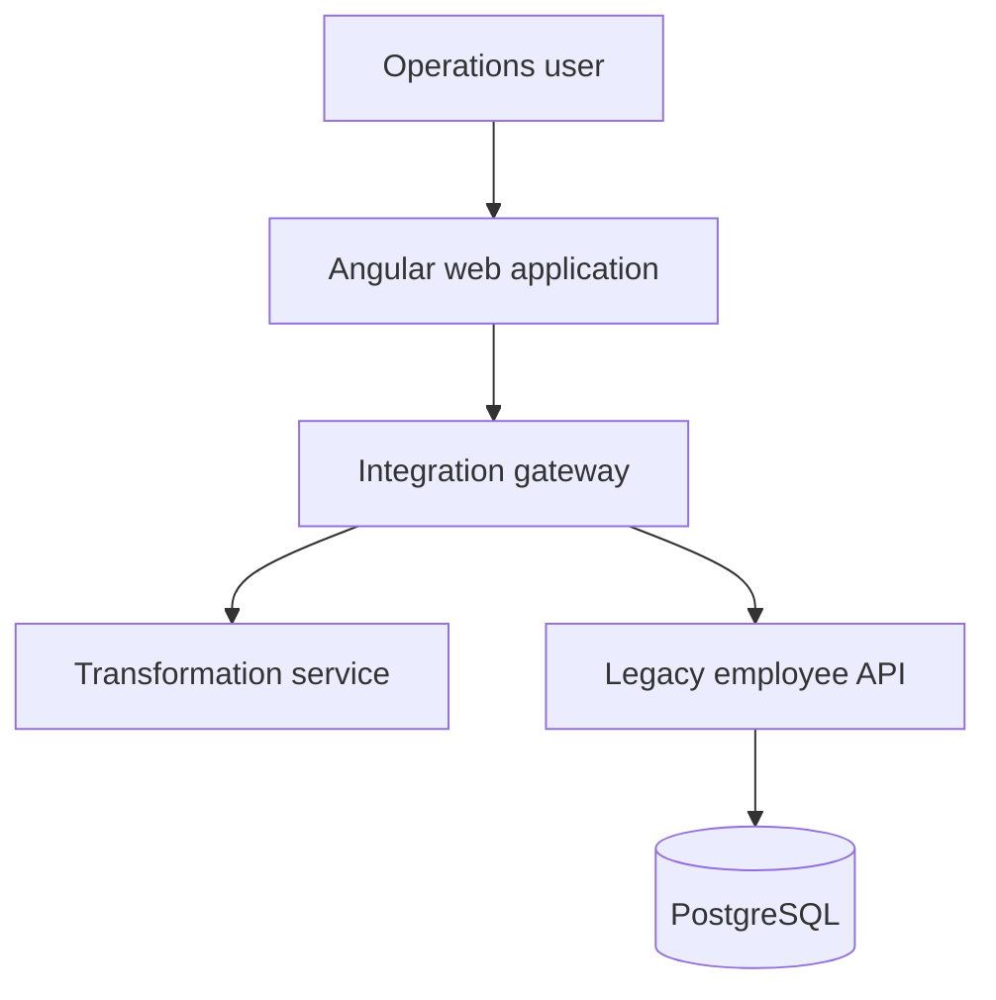
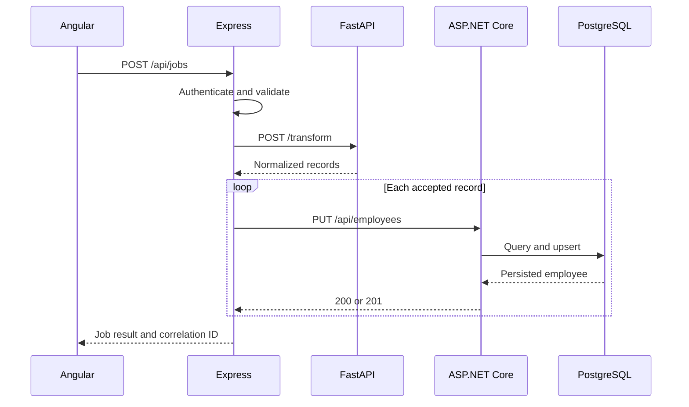
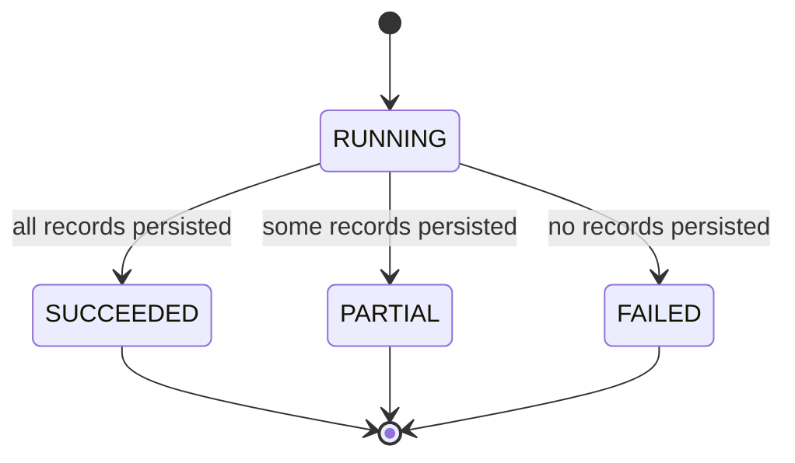
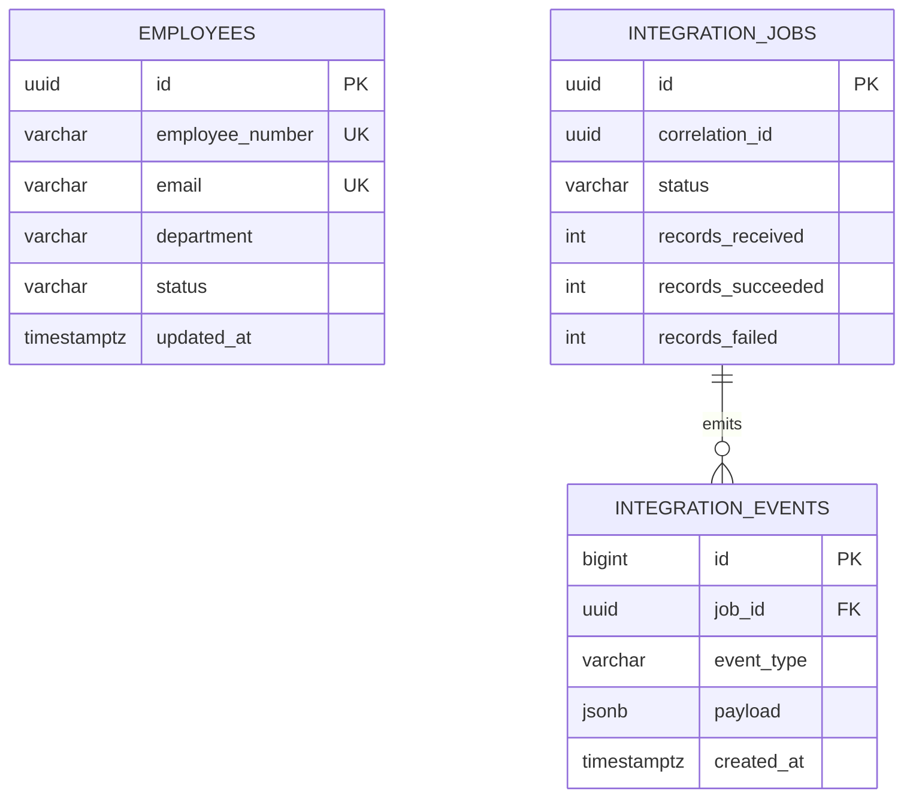

# Architecture

## System context

Integration Operations Hub models a common enterprise requirement: accept records from a modern user interface, validate and transform them, then synchronize them with a legacy system without exposing upstream complexity to the browser.

## Component responsibilities

### Angular web application

The browser provides the operator experience and owns presentation concerns only.

- Builds a typed synchronization request from a reactive form.
- Adds authentication and correlation headers through an HTTP interceptor.
- Uses a route guard to initialize the local demonstration session.
- Filters jobs through a debounced RxJS pipeline.
- Uses `switchMap` so a newer filter cancels the previous HTTP observable.
- Renders job state, record counts, timestamps, and trace identifiers.

The web application intentionally does not know the transformer's or legacy API's address. It calls the gateway through `/api` and can therefore survive internal service moves or contract changes.

### Node.js/Express gateway

The gateway is both an API gateway and a backend-for-frontend.

- Terminates the browser-facing REST contract.
- Validates untrusted JSON with Zod.
- Enforces the demonstration bearer token.
- Accepts or creates a correlation ID and returns it in every response.
- Coordinates transformer and legacy calls.
- Converts upstream failures into a stable error envelope.
- Applies timeouts, retries, and circuit breakers.
- Preserves partial success with `Promise.allSettled`.
- Tracks recent jobs for the demonstration dashboard.

The current job list is in memory to keep the sample focused. Durable deployments should persist jobs and events in PostgreSQL or publish them to a message broker.

### Python/FastAPI transformer

The transformer is the data-quality boundary.

- Parses camelCase JSON into typed Pydantic models.
- Trims whitespace and normalizes names, email addresses, employee numbers, departments, and statuses.
- Rejects invalid record shapes before they reach persistence.
- Detects duplicate employee numbers inside one request.
- Returns normalized records and non-fatal warnings.
- Generates OpenAPI documentation from the same models used at runtime.

Keeping these rules separate makes them independently testable and prevents the gateway from becoming a collection of source-system-specific transformations.

### C#/.NET legacy API

The legacy API models a typed enterprise service around an existing database.

- Uses ASP.NET Core controllers and built-in dependency injection.
- Returns RFC 7807 Problem Details for failures.
- Uses `EmployeeService` to keep HTTP and persistence concerns separate.
- Uses EF Core and LINQ for filtering, projection, and updates.
- Normalizes employee number as an idempotency key.
- Enforces unique employee number and email indexes.
- Publishes Swagger and health endpoints.

### PostgreSQL

PostgreSQL stores employees and defines tables for job and event history.

- Relational constraints protect data quality.
- Unique indexes enforce stable identities.
- `JSONB` event payloads allow source-specific diagnostic details without weakening the primary employee schema.
- The initialization script includes deterministic sample records.

## Synchronization sequence

## Job states

`QUEUED` exists in the public contract for a future asynchronous implementation. The current synchronous demonstration moves directly into `RUNNING`.

## Data model

The current gateway keeps jobs in memory, so the job and event tables define the intended durable model rather than an already wired repository. That distinction is recorded in the roadmap and verification report.

## Contract boundaries

### Browser to gateway

The browser depends on one camelCase contract. It never receives FastAPI validation internals or ASP.NET Core stack information.

### Gateway to transformer

The gateway passes candidate records and expects normalized records plus warnings. A transform failure stops the persistence phase because unvalidated data must not cross the legacy boundary.

### Gateway to legacy API

Each normalized record is upserted independently. The gateway aggregates results so one record failure does not erase successful work.

## Reliability design

### Timeout

Every upstream request gets an `AbortController`. A timeout releases gateway resources and becomes a predictable `UPSTREAM_TIMEOUT` response.

### Retry

The gateway retries network errors and server-side failures with bounded exponential backoff. Client-side validation failures are not retried because the same request will fail again.

### Circuit breaker

Three consecutive failures open the circuit. Calls fail fast for 30 seconds, then a half-open request tests recovery. Success resets the failure count and closes the circuit.

### Partial success

`Promise.allSettled` records each legacy update outcome. The final job state is computed as follows:

- All fulfilled: `SUCCEEDED`.
- Some fulfilled: `PARTIAL`.
- None fulfilled: `FAILED`.

### Idempotency

Employee number is normalized to uppercase and protected by a unique index. Repeating a request updates the same employee instead of creating another row.

## Security boundaries

The local bearer token demonstrates header propagation but is not production authentication. A real deployment should add:

- OIDC provider and short-lived signed JWTs.
- Issuer, audience, signature, expiration, and scope validation.
- Role-based authorization for read and write operations.
- TLS from browser to gateway and between internal services.
- Managed secrets and automated rotation.
- Rate limiting, request-size limits, and abuse protection.
- Restricted database and service identities using least privilege.
- Dependency and container scanning in CI.

## Observability model

Correlation IDs are the common trace key. Structured logs should include:

- Timestamp and severity.
- Service name and environment.
- Correlation ID and job ID.
- HTTP method, route, status, and elapsed time.
- Upstream name, attempt number, and circuit state.
- Record counts without sensitive employee payloads.

The next production step is OpenTelemetry instrumentation exported to a trace backend, plus Prometheus metrics for latency, error rate, retries, open circuits, queue depth, and job outcomes.

## Scaling path

The current synchronous request flow is appropriate for a compact demonstration. Higher-volume production workloads should:

1. Persist the job before processing.
2. Publish record batches to a durable queue.
3. Process with independently scaled workers.
4. Store job events and checkpoints.
5. Send failed messages to a dead-letter queue.
6. Update the dashboard through polling, server-sent events, or WebSockets.

The gateway remains the browser contract even when execution becomes asynchronous.

## Trade-offs

| Decision | Benefit | Limitation |
| --- | --- | --- |
| REST orchestration | Easy to understand, call, and trace locally. | Caller waits for upstream services. |
| In-memory job list | Minimal setup and clear sample code. | Lost on restart and not horizontally scalable. |
| Separate transformer | Clear ownership and independent testing. | Adds a network hop and deployment unit. |
| Per-record legacy calls | Makes partial success explicit. | Less efficient than bulk endpoints at scale. |
| Development bearer token | Simple local workflow. | Must be replaced before deployment. |
| Bootstrap SQL | Fast local initialization. | Production requires managed migrations. |

