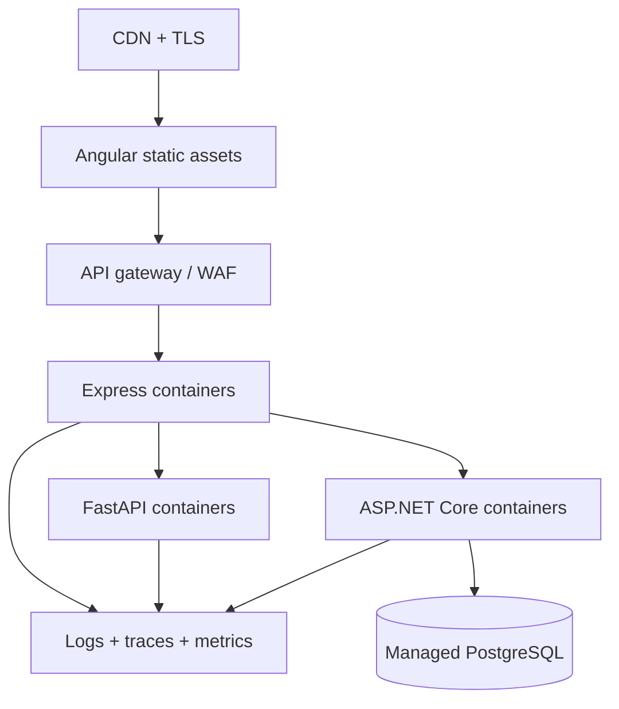

# Deployment Guide

Docker Compose is the supported local topology. This document describes how the same service boundaries map to a production environment; it is not a claim that a production deployment has already been performed.

## Production topology



## Build images

```bash
docker build -t integration-hub-web:1.0.0 apps/web
docker build -t integration-hub-gateway:1.0.0 services/gateway
docker build -t integration-hub-transformer:1.0.0 services/transformer
docker build -t integration-hub-legacy-api:1.0.0 services/legacy-api
```

Tag and push images to an authenticated container registry. Use immutable version or commit-SHA tags instead of `latest` for production rollouts.

## Cloud mapping

| Concern | AWS example | Azure example | GCP example |
| --- | --- | --- | --- |
| Angular | S3 + CloudFront | Static Web Apps or Storage + CDN | Cloud Storage + Cloud CDN |
| Containers | ECS/Fargate or EKS | Container Apps or AKS | Cloud Run or GKE |
| PostgreSQL | RDS for PostgreSQL | Azure Database for PostgreSQL | Cloud SQL for PostgreSQL |
| Secrets | Secrets Manager | Key Vault | Secret Manager |
| Logs/metrics | CloudWatch + X-Ray/OTel | Azure Monitor | Cloud Logging/Trace |
| Registry | ECR | ACR | Artifact Registry |

The services are stateless except PostgreSQL and the current in-memory gateway job list. Persisting job state is required before running more than one gateway replica.

## Required production changes

### Authentication

- Replace `DEV_BEARER_TOKEN` with OIDC/JWT validation.
- Configure issuer, audience, JWKS rotation, expiry, and scopes.
- Use service identities for gateway-to-service calls.

### Secrets

- Store database passwords, signing configuration, and third-party credentials in a secret manager.
- Inject secrets at runtime.
- Rotate credentials and audit access.
- Never bake secrets into container images or CI logs.

### Networking

- Expose only the web application and public gateway.
- Keep transformer, legacy API, and PostgreSQL on private networks.
- Require TLS for external and internal traffic.
- Apply egress restrictions when upstream destinations are known.

### Database

- Replace bootstrap-only SQL with versioned migrations.
- Enable backups, point-in-time recovery, encryption, and deletion protection.
- Use least-privilege application credentials.
- Configure connection pooling and maximum connection limits.

### Reliability

- Persist integration jobs before processing.
- Use a durable queue for long-running or high-volume batches.
- Add dead-letter handling and replay controls.
- Configure readiness and liveness probes separately.
- Use rolling or blue/green deployment with automatic rollback.

### Observability

- Instrument all services with OpenTelemetry.
- Export latency, traffic, error, retry, circuit, and job metrics.
- Centralize structured logs with correlation and job IDs.
- Alert on error budgets, open circuits, dependency failures, and queue backlog.

## Environment checklist

| Setting | Local | Production expectation |
| --- | --- | --- |
| Authentication | Static demo token | OIDC/JWT and RBAC |
| TLS | Host-dependent | Required end-to-end |
| Job state | Gateway memory | Durable database/event store |
| Database | Local container | Managed HA PostgreSQL |
| Secrets | `.env` | Managed secret store |
| Scaling | One container each | Independent horizontal scaling |
| Telemetry | Structured console logs | Central logs, metrics, traces, alerts |

## Release process

1. Run unit, integration, build, and security checks.
2. Build immutable images from the reviewed commit.
3. Generate a software bill of materials and scan images.
4. Deploy database migrations with rollback planning.
5. Deploy services to a non-production environment.
6. Run smoke and contract tests.
7. Promote the same images to production.
8. Monitor health, latency, errors, and business job outcomes.
9. Roll back automatically when release thresholds are breached.

